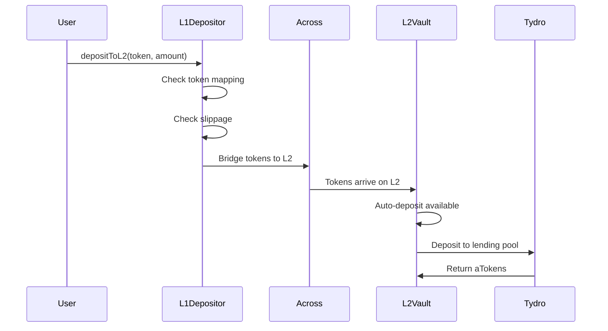
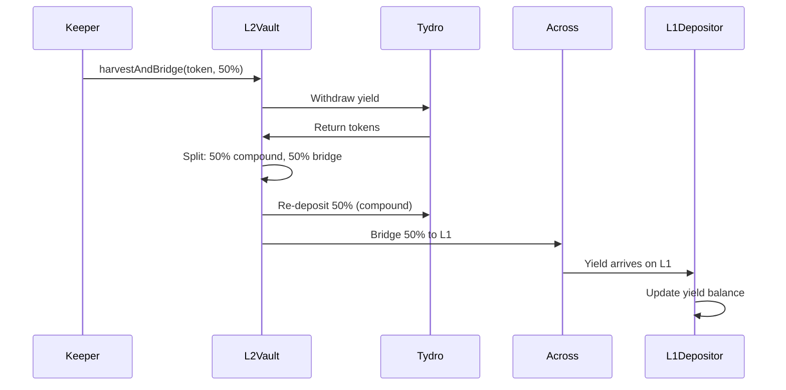

# User Flows

## Overview

This document describes the complete user flows for deposits and yield harvesting in the L1-L2 Ink Yield Bundler system.

---

## 1. Deposit Flow (L1 → L2)

The deposit flow enables users to deposit tokens on Ethereum Mainnet, which are automatically bridged to Ink L2 and deployed to yield strategies.

### Step-by-Step Process

1. **User Initiates Deposit**: Owner calls `depositToL2()` on L1Depositor with token address and amount
2. **Token Mapping Check**: Contract verifies the L1 token has a valid L2 mapping
3. **Slippage Validation**: Contract checks that the minimum amount meets slippage requirements
4. **Bridge Initiation**: L1Depositor calls Across Protocol's HubPool to bridge tokens to L2
5. **Tokens Arrive**: L2Vault receives tokens via Across bridge callback
6. **Auto-Deposit**: L2Vault automatically deposits available tokens to yield strategies
7. **Strategy Deployment**: Tokens are deployed to Tydro (or Velodrome) based on allocation strategy
8. **Confirmation**: Strategy returns receipt tokens (e.g., aTokens from Tydro)

---

## 2. Yield Harvest Flow (L2 → L1)

The harvest flow allows keepers to harvest accumulated yield from L2 strategies and bridge a portion back to L1.

### Step-by-Step Process

1. **Harvest Trigger**: Keeper calls `harvestAndBridge()` on L2Vault with token and compound percentage
2. **Yield Withdrawal**: L2Vault withdraws accumulated yield from Tydro (or other strategies)
3. **Yield Calculation**: Contract calculates available yield: `currentBalance - depositedAmount`
4. **Split Strategy**: Yield is split based on `compoundPercent`:
   - **Compound Portion**: Re-deposited to strategies to increase principal
   - **Bridge Portion**: Prepared for bridging back to L1
5. **Re-deposit**: Compound portion is re-deposited to yield strategies
6. **Bridge Initiation**: Bridge portion is sent via Across Protocol's SpokePool to L1
7. **Yield Arrives**: L1Depositor receives bridged yield tokens
8. **Balance Update**: L1Depositor updates `yieldBalance` mapping for the token
9. **User Withdrawal**: Users can later call `withdrawYield()` to claim their yield

---

## Flow Characteristics

### Deposit Flow
- **Initiation**: Owner-only on L1
- **Automation**: Auto-deposits to strategies on L2
- **Gas Efficiency**: Single transaction initiates entire flow
- **Slippage Protection**: Configurable minimum amounts

### Harvest Flow
- **Flexible Compounding**: Configurable compound percentage per harvest
- **Split Strategy**: Simultaneous compounding and bridging
- **Keeper-Friendly**: Can be called by anyone (owner-only recommended)
- **Yield Tracking**: Automatic yield balance updates on L1

---

## Related Documentation

- [Contract Responsibilities](./contracts.md) - Functions used in these flows
- [Bridge Architecture](./bridge.md) - Detailed bridge mechanics
- [Yield Strategies](./yield-strategies.md) - Strategy allocation and compounding

