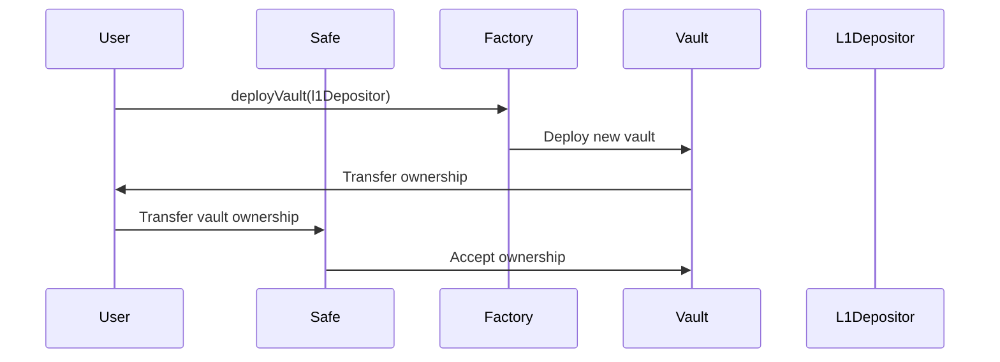
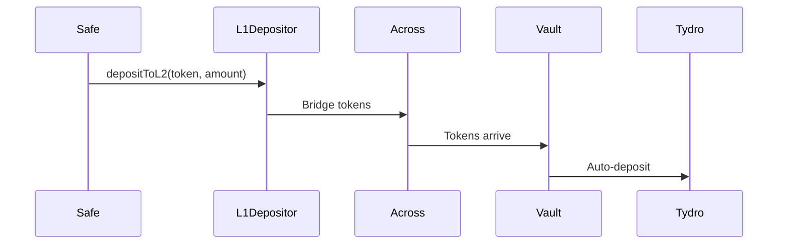
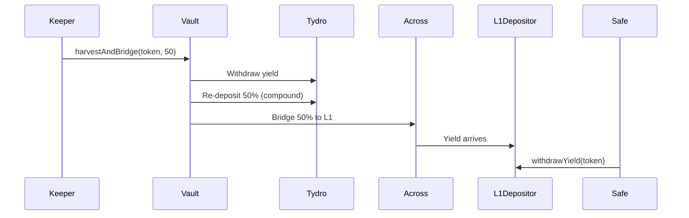

# User Guide

Complete guide for using the Ink Yield Bundler system.

***

## 🎯 Getting Started

### Prerequisites

* Ethereum wallet (MetaMask, Rabby, Kraken Wallet, WalletConnect, etc.)
* ETH for gas on both L1 and L2
* Tokens to deposit (e.g., USDT)
* Access to Ink L2 network

### Quick Start Checklist

* [ ] Deploy or connect to L1Depositor contract
* [ ] Deploy your private vault via Factory
* [ ] Fund vault with ETH for gas
* [ ] Make your first deposit

***

## 📱 Gnosis Safe Integration

### Why Use Gnosis Safe?

* ✅ **Multisig Security**: Require multiple signatures for operations
* ✅ **Access Control**: Granular permissions
* ✅ **Transaction History**: Complete audit trail
* ✅ **Recovery**: Social recovery options

### Setup with Gnosis Safe

#### Step 1: Deploy Vault

Deploy your vault with your EOA (Externally Owned Account):

```solidity
// Deploy vault
address myVault = factory.deployVault(l1DepositorAddress);
```

#### Step 2: Transfer Ownership

Transfer vault ownership to your Gnosis Safe:

```solidity
// Transfer ownership
BundledYieldVaultV2_(myVault).transferOwnership(safeAddress);
```

#### Step 3: Accept Ownership (in Safe)

Create a transaction in Gnosis Safe to accept ownership:

```solidity
// In Safe interface
// Transaction: acceptOwnership()
// Requires: 2 of 3 signatures (or your threshold)
```

#### Step 4: Configure Safe

Set up your Safe with required signers and threshold:

* **Signers**: Add trusted addresses
* **Threshold**: Set required signatures (e.g., 2 of 3)
* **Modules**: Add any required modules

### Operating from Gnosis Safe

All vault operations now require Safe multisig approval:

#### Deposit to L2

```solidity
// In Safe interface
// Transaction: depositToL2(usdt, 10_000_000_000, 9_950_000_000)
// Requires: 2 of 3 signatures
```

#### Harvest Yield

```solidity
// In Safe interface
// Transaction: harvestAndBridge(usdt0, 50)
// Requires: 2 of 3 signatures
```

#### Withdraw Yield

```solidity
// In Safe interface
// Transaction: withdrawYield(usdt, safeAddress)
// Requires: 2 of 3 signatures
```

***

## 💰 Making Deposits

### Step 1: Approve Tokens

Before depositing, approve the L1Depositor to spend your tokens:

```solidity
// Approve USDT
IERC20(usdt).approve(l1Depositor, 10_000_000_000);
```

**Via Safe**: Create approval transaction in Safe interface.

### Step 2: Deposit to L2

Deposit tokens to L2 via the L1Depositor:

```solidity
// Deposit 10,000 USDT
l1Depositor.depositToL2(
    usdt,              // Token address
    10_000_000_000,    // Amount (6 decimals)
    9_950_000_000      // Min amount (0.5% slippage)
);
```

**What happens**:

1. Tokens are transferred to L1Depositor
2. Tokens are bridged to L2 via Across
3. Tokens arrive at L2 vault (\~2-3 seconds)
4. Vault can auto-deposit to yield strategies

### Step 3: Auto-Deposit (Optional)

The vault can automatically deposit bridged tokens:

```solidity
// Auto-deposit with smart allocation
vault.depositAvailable(usdt0, true);

// Or auto-deposit to Tydro
vault.depositAvailable(usdt0, false);
```

**Keeper-friendly**: Anyone can call this function to trigger auto-deposit.

***

## 🌾 Harvesting Yield

### Check Available Yield

Before harvesting, check how much yield is available:

```solidity
// Check yield
uint256 yield = vault.getYieldAvailable(usdt0);
```

### Harvest and Bridge

Harvest yield and split between compounding and bridging:

```solidity
// Harvest with 50% compound, 50% bridge
vault.harvestAndBridge(usdt0, 50);
```

**What happens**:

1. Yield is withdrawn from Tydro
2. 50% is re-deposited (compound)
3. 50% is bridged to L1 via Across
4. Yield arrives at L1Depositor (\~2-3 seconds)

### Withdraw Yield on L1

After yield arrives on L1, withdraw it:

```solidity
// Withdraw yield
l1Depositor.withdrawYield(usdt, safeAddress);
```

***

## 📊 Monitoring Your Vault

### Check Vault Status

```solidity
// Get comprehensive status
(uint256 deposited, uint256 balance, uint256 yield, uint256 gas) = 
    vault.getStatus(usdt0);
```

**Returns**:

* `deposited`: Original principal
* `balance`: Current balance in strategies
* `yield`: Available yield to harvest
* `gas`: ETH balance for gas

### Check Yield Available

```solidity
// Get yield amount
uint256 yield = vault.getYieldAvailable(usdt0);
```

### Check L1 Yield Balance

```solidity
// Check yield balance on L1
uint256 yieldBalance = l1Depositor.yieldBalance(usdt);
```

***

## 🔄 Complete User Flow

### Initial Setup



### Deposit Flow



### Harvest Flow



***

## 🛠️ Common Operations

### Update Token Mapping

```solidity
// On L1
l1Depositor.setTokenMapping(usdtL1, usdt0L2);

// On L2
vault.setTokenMapping(usdt0L2, usdtL1);
```

### Update L1 Recipient

```solidity
// Set new L1 recipient
vault.setL1Recipient(newL1Depositor);
```

### Configure Yield Split

```solidity
// Set default compound percentage
vault.setDefaultCompoundPercent(60);  // 60% compound, 40% bridge
```

### Fund Vault with Gas

```solidity
// Send ETH to vault
payable(vault).transfer(0.1 ether);
```

***

## ⚠️ Important Considerations

### Gas Management

* **L2 Vault**: Keep funded with ETH for operations
* **Minimum Balance**: Recommended 0.05 ETH minimum
* **Auto-Refill**: Vault can auto-refill from bridge amounts

### Slippage Protection

* **Default**: 0.5% max slippage
* **Adjustable**: Can be updated by owner
* **Bridge Slippage**: Separate from DEX slippage

### Timing

* **Bridge Time**: \~2-3 seconds (Across)
* **Yield Generation**: 24-48 hours minimum
* **Harvest Frequency**: Weekly recommended

### Security

* **Owner-Only**: All critical operations require ownership
* **Multisig**: Use Gnosis Safe for added security
* **Monitor**: Regularly check vault status

***

## 🆘 Troubleshooting

### "Token not supported"

→ Set token mapping on both L1 and L2 contracts

### "Insufficient gas"

→ Send more ETH to L2 vault

### "No yield available"

→ Wait longer (24-48 hours minimum)

### "Bridge doesn't complete"

→ Check Across transaction status

### "Slippage too high"

→ Adjust minAmount or maxSlippageBps

***

## 📚 Additional Resources

* [Core Contracts](../contracts/)
* [Factory Deployment](../factory/)
* [Yield Strategies](../architecture/yield-strategies/strategies.md)
* [Deployment Guide](broken-reference)

***

## 💡 Tips & Best Practices

1. **Use Multisig**: Always use Gnosis Safe for production
2. **Monitor Regularly**: Check vault status weekly
3. **Harvest Frequently**: Harvest yield weekly for optimal compounding
4. **Diversify**: Consider multiple strategies
5. **Keep Gas Funded**: Maintain minimum ETH balance
6. **Test First**: Test on testnet before mainnet
